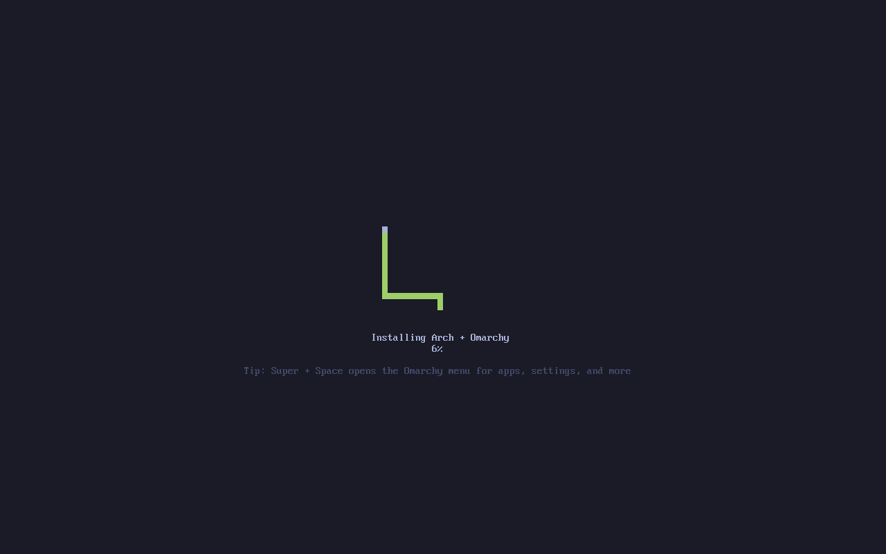
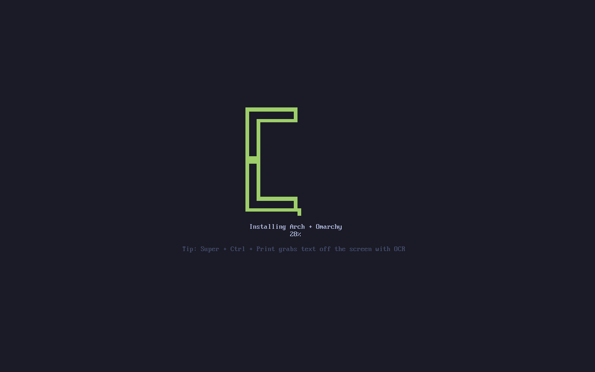
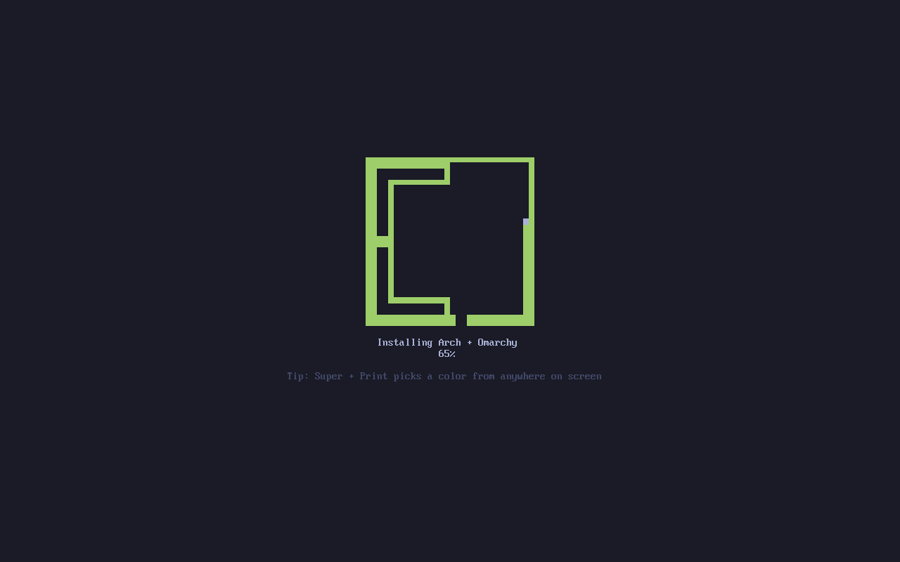
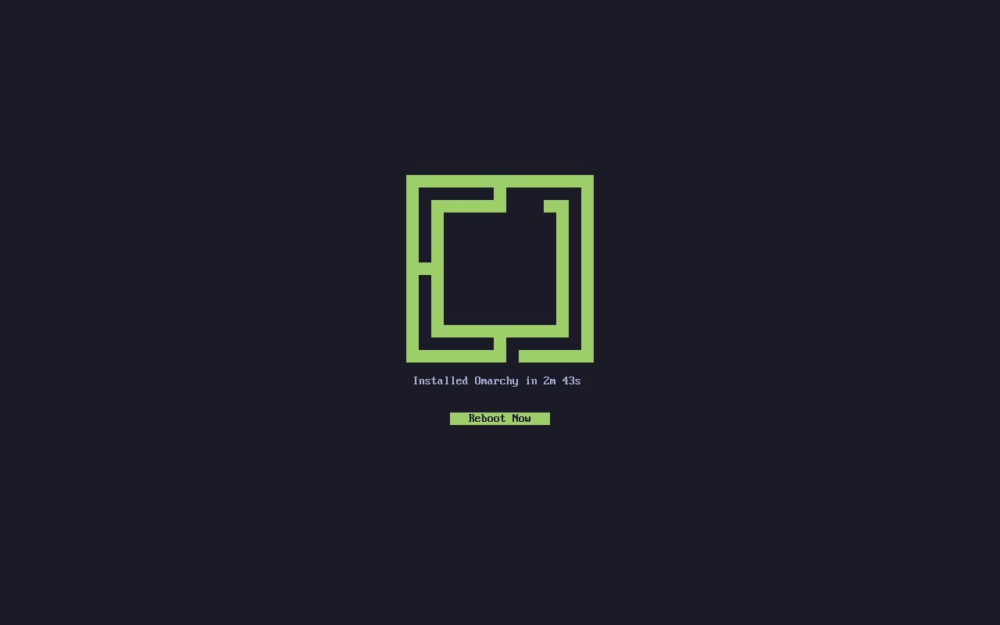
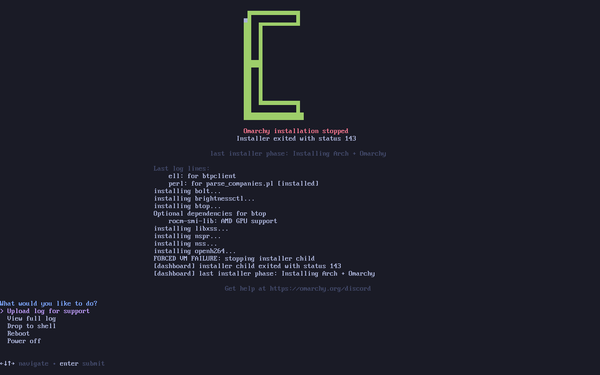

# Installer snake

The path is generated during development with `python3 assets/install-snake/generate.py`.
The ISO reads the committed 380-line path and uses Bash/ANSI only. No video,
image conversion, Python generator, or new package is needed at install time.

The coarse grid was checked against the official site SVG
(`omacom/omarchy-site`, `brand/omarchy-logo.svg`, blob
`aa239e1f0402c3b22be01c9484f4eecedad2935e`) at 1/80 scale and at full-size cell
centres. All 95 cells match. Coordinates are zero-based: the mouth is (14,8),
and (13,7) has two neighbours, despite the original brief calling it a dead end.

A heading-first DFS makes a spanning tree of the coarse grid. Each coarse cell
becomes a four-cell cycle; merging facing edges along the tree produces one
Hamiltonian cycle on the doubled grid. Its 380 cells cover the logo exactly,
with no gaps, overlaps or duplicated cells.

## Progress and rendering

The existing phase bands are retained as approximate work weights: the package
phase spans 6.5–70%, configuration spans 72–85%, and boot finalization spans
85.5–95%; smaller phases fill the remaining bands. Entering the next phase
credits the previous one. During package installation only the actual target
pacman database count advances progress, divided by the build's resolved
package count and capped below the next phase boundary. These weights describe
work, not elapsed time or a prediction of time remaining. With no valid count,
progress waits at the phase boundary. Unknown phases hold the previous value.
The existing atomic state file and log writers are unchanged.

Length is `1 + floor(progress_per_mille * 379 / 1000)`, capped at six new cells
per 100ms-or-longer frame. Progress is monotonic and has no time-based bonus.
A stalled head blinks without extending the snake. State is sampled at 2Hz;
rendering runs at no more than 10Hz and only changed logo rows are written.
Frame delays use PR #1's private-pipe timed read, avoiding a new `sleep`
process on every frame; `sleep` remains a fallback if the pipe is unavailable.
100% requires the actual installer's successful exit, not merely `finished_at`.
The full logo then flashes briefly and remains above the existing reboot prompt.

The Linux VT uses its existing palette, including colour 2 (`#9ece6a`). The
loaded console Unicode map must contain U+2580, U+2584 and U+2588; missing or
unreadable coverage keeps the old wordmark/bar, or a compact percentage/stage
line when the wordmark will not fit. UTF-8 terminal emulators use half-blocks.
`NO_COLOR` suppresses colour. A terminal below 40 columns or 22 rows starts with
plain log output. No TTY or TERM=dumb also streams logs without escapes. A live
resize into a small terminal switches to one compact status line and can grow
back into the snake. On failure, a tall console keeps the frozen snake; 80x25
reserves the space for the error and existing log actions. Unattended success
still reboots, unless OMARCHY_UI_AUTO_REBOOT=no.
Interactive plain output ends with an explicit installed message and `reboot`
instruction. Deferred-provisioning installs retain automatic reboot in plain
mode as well. Failed installs keep their nonzero exit status and never print
the success instruction.

## Evidence and limits

Run `bash test/unit/install-snake-test.sh` for path assertions, renderer samples
at p=0, 1/379, 0.5 and 1, bounded monotone growth, stalled work, success gating,
80x25 and large-console PTY runs, forced failure, Ctrl-C, NO_COLOR, small-console
and non-TTY output, live resize, all 380 incremental screens, and synthetic font-map dispatch. These are simulated
installer children, not actual disk installations. `bin/omarchy-iso-installer`
previews the real renderer using simulated installation progress.

Consolidation from PR #1 adds real package-database replay through long stalls,
bursts, disappearing entries, excessive counts and unknown phases, plus an
explicit last-cell success gate, duplicate-path rejection and a private-pipe
timer check. The `Installer dashboard tests` workflow runs the focused snake
and media-diagnosis suites on pull requests and pushes to the integration
branches. These checks do not build or boot an ISO. The VM evidence below
predates this consolidation and does not validate the new timer/plain-output
changes on a booted ISO.

A local-source ISO built on Ubuntu 24.04 in GitHub Actions and completed an actual
headless QMP/OCR install via `./bin/omarchy-iso-test --install-only --no-preview`
([successful run](https://github.com/tcballard/omarchy-iso/actions/runs/35908004848)).
The ISO console rendered the half-block glyphs and existing green palette.
The finished logo appeared at the reboot prompt after 2m 43s.
The test build omitted `apple-bcm-firmware` from the temporary Omarchy source
checkout because the T2 mirror did not supply that optional Mac firmware;
this repository and the proposed installer patch do not change that package.

Real ISO QMP screenshots, in installation order:

A separate test-only ISO injected a SIGTERM into the installer child after 70
seconds of real package installation; its QMP/OCR test verified the stopped
screen ([forced-failure run](https://github.com/tcballard/omarchy-iso/actions/runs/35910942334)).
The partial snake, error status, phase, log tail and support actions remained
readable:

The portable suite covers smaller terminals, resizing, Ctrl-C, missing glyphs,
`NO_COLOR`, and non-TTY fallback. The real VM covered its default large console;
the too-small and 80x25 cases were exercised by the PTY tests. A true 50% VM
frame was not captured (the timed samples caught 28% and 65%). The Python
portion of `./test/all` requires systemd as PID 1 and cannot run in this
container; the targeted snake and media-diagnosis tests passed locally.
